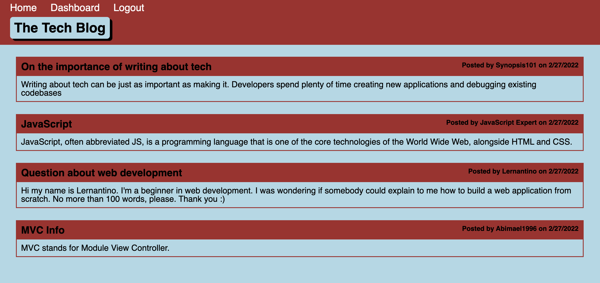

# Tech Blog

## Description
    
The Tech Blog is an internet forum for developers to discuss about tech.
    
## Usage
    
Click on the login button to log into youre account if you have one, otherwise click on "Sign up instead" to create a user. Once you're logged in you can click on any post from the homepage and add a comment. You can also create your own post by navigating to Dashboard and clicking on "New Post", which would add the post to your dashboard; from there, you can delete or update any of your posts.

Visit the blog: https://sheltered-reaches-16118.herokuapp.com/

## Contribute
    
If you would like to contribute to this project, feel free to make a pull request.
    
## Questions

If you have any questions, open an issue or contact me directly at abimael.monarrez58@gmail.com. You can find more of my work at [Abimael1996](https://github.com/Abimael1996).

